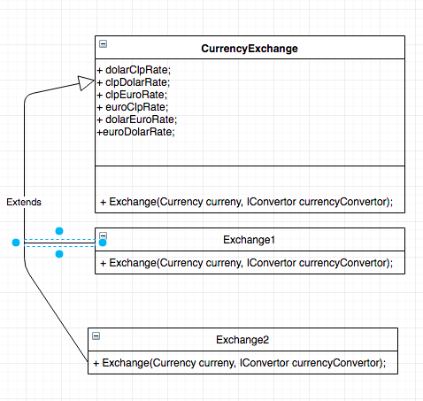
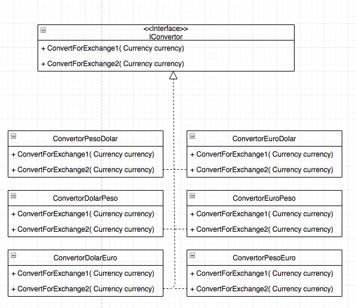
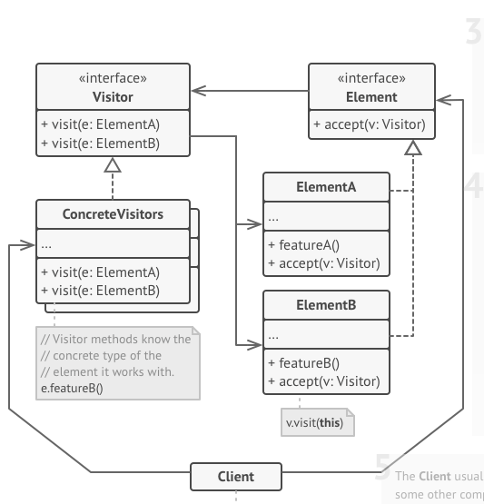

# iic2113-ac04

## Integrantes
    - Octavio Vera
    - Gabriel Lyon

## Modelamiento

Para el modelamiento del problema se intentó modificar lo menos posible
la clase `CurrencyExchange` y las clases hijas `Exchange1` y `Exchange2`.

Podemos ver un diagrama UML de estas clases, donde se realizaron las siguiente modificaciones:
1. Se agregaron las tasas de cambio `Rates` como atributos de las clases del tipo `CurrencyExchange`.
2. Se modificó el método `Exchange(Currency from, String to)`, cambiando el segundo parametro
    por _Visitor_ (`IConvertor currencyConvertor`).

En la segunda imagen, se muestra el diagrama UML para el modelamiento del patrón _Visitor_.
Se creó una interfaz con dos métodos: `ConvertForExchange1` y `ConvertForExchange2` de esta
manera cada clase concreta (`Exchange1` y `Exchange2`) tienen un método para su propio comportamiento.
Luego, se requería poder hacer transformaciones para las siguientes monedas: Euro, Dolar y Pesos.
Por lo que, se implementaron los siguientes "convertidores" (_Visitors_):
1. `ConvertPesoDolar`
2. `ConverDolarPeso`
3. `ConvertPesoEuro`
4. `ConvertEuroPeso`
5. `ConvertDolarEuro`
6. `ConvertEuroDolar`

Ahora se puede modelar las transformaciones con el método `Exchange` en las sub clases `Exchange1` y `Exchange2`
entregandoles el convertidor (_Visitor_) correspondiente para la transformacion.

Nos basamos en el diagrama del patrón propuesto [aquí](https://refactoring.guru/design-patterns/visitor). Ocupandolo de guía al igual que el video recomendado por el profesor.

## Estructura del Código

En el archivo `ICurrencyConvertor.cs` está la **interfaz** `IConvertor`, y en el archivo
`Convertors.cs` están las clases que implementan la interfaz (_Visitors_).

El archivo `CurrencyExchange.cs`, `Exchange1.cs` y `Exchange2.cs` se modificó según lo descrito inicialmente.

Adicionalmente, se agregó un archivo `ExchangerApp.cs` que implementa una App de Terminal que permite ejecutar las distintas funcionalidades y testear el funcionamiento correcto del patrón _Visitor_. Es importante que esta pequeña 
simulación solo permite números como _input_ cualquier otro valor hará que se caiga la app.

## Conclusiones

Con el patrón implementado se pueden agregar nuevas monedas de manera muy sencilla y sin modificar gran parte del código antiguo.
Si se agrega una nueva moneda, por ejemplo Rupias, se debe agregar 6 nuevas
clases para las transformaciones necesarias, que implementen la interfaz `IConvertor`. Luego, las clases `Exchange{i}` no tendrian que modificar su comportamiento. De manera similar, si se desea agregar nuevas Casas de cambios digamos `Exchange3`, solo se debe agregar el método `ConvertForExchange3` en la interfaz: `IConvertor`, junto a su implementación en todos los convertores.

Nótese, que en esta solución ocurre la **particularidad** de que los métodos `ConvertForExchange1` y
`ConvertForExchange2` ejecutan las mismas acciones para las clases `Exchange1` y `Exchange2` respectivamente.
Sin embargo, esto es mera casualidad, ya que si ahora se quisiera cambiar la forma en que una de las casas
de cambio calcula su `Exchange` se podría implementar en el método correspondiente. Por
ejemplo: si la casa de cambio 2 (`Exchange2`) ahora agrega porcentaje de la transacción, se puede implentar
sin afectar el funcionamiento de `Exchange1`.
